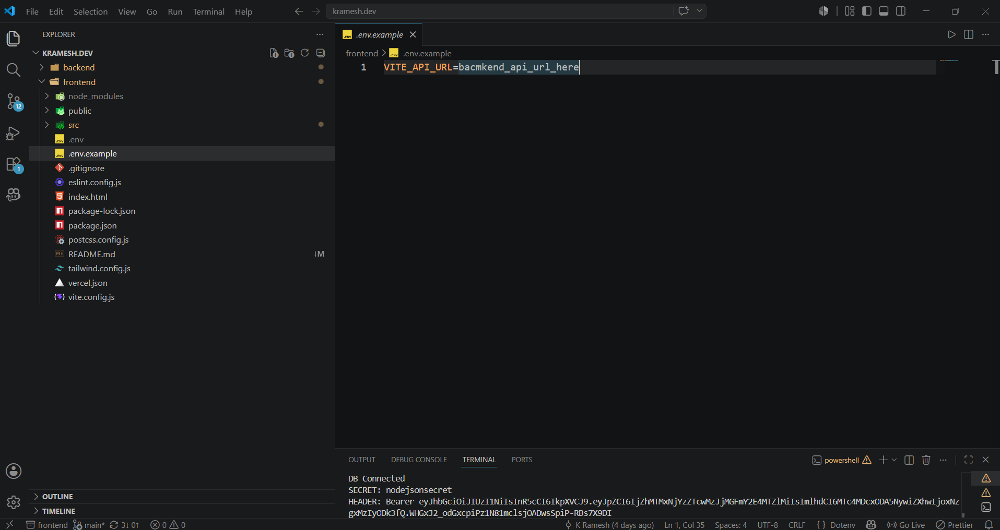
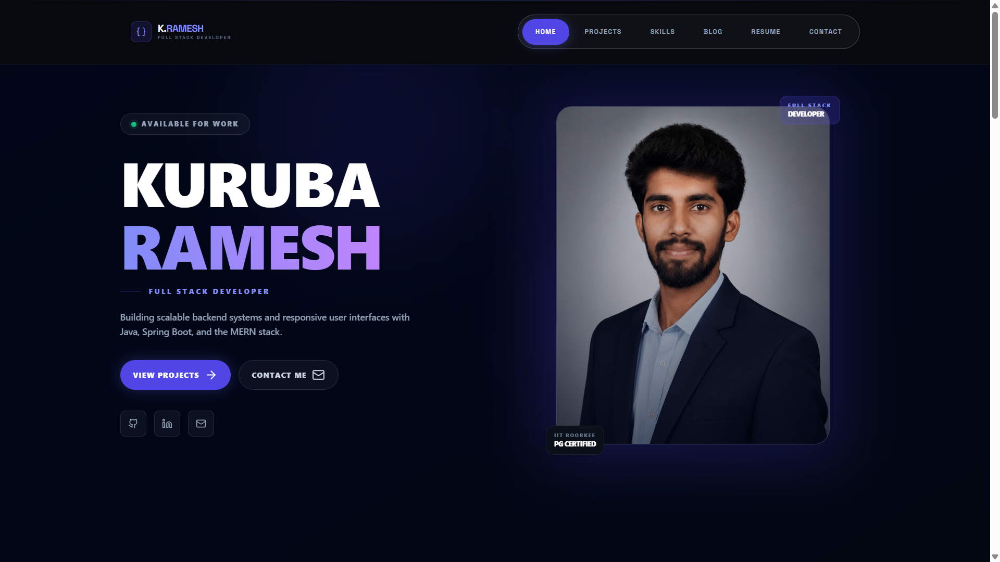

# kramesh.dev — Frontend

Personal portfolio website for Kuruba Ramesh — built with React, Vite and Tailwind CSS.

## 🔗 Live Site
```
https://krameshdev.vercel.app
```

## 🛠️ Tech Stack

- **Framework:** React 18 + Vite
- **Styling:** Tailwind CSS
- **Animations:** Framer Motion
- **Routing:** React Router DOM
- **HTTP Client:** Axios
- **Toast:** React Hot Toast
- **Icons:** Lucide React
- **Deployment:** Vercel

## 📁 Folder Structure

```
frontend/src/
├── admin/                      # Protected admin pages
│   ├── Login.jsx
│   ├── Dashboard.jsx
│   ├── ManageAbout.jsx
│   ├── ManageProjects.jsx
│   ├── ManageSkills.jsx
│   ├── ManageBlogs.jsx
│   ├── ManageCertifications.jsx
│   ├── ManageEducation.jsx
│   ├── ManageExperience.jsx
│   └── ManageMessages.jsx
│
├── api/
│   └── axios.js               # Axios instance with JWT interceptor
│
├── assets/                    # Images and static files
│
├── components/
│   ├── admin/
│   │   └── AdminLayout.jsx    # Sidebar layout for admin
│   ├── home/                  # Home page sections (lazy loaded)
│   │   ├── Hero.jsx
│   │   ├── TechStack.jsx
│   │   ├── FeaturedProjects.jsx
│   │   ├── Certifications.jsx
│   │   ├── Education.jsx
│   │   ├── Experience.jsx
│   │   ├── CTA.jsx
│   │   └── FadeInSection.jsx
│   ├── Navbar.jsx
│   ├── Footer.jsx
│   └── Loader.jsx
│
├── context/
│   └── AuthContext.jsx        # JWT auth state management
│
├── pages/                     # Public pages
│   ├── Home.jsx
│   ├── Projects.jsx
│   ├── Skills.jsx
│   ├── Blog.jsx
│   ├── BlogDetail.jsx
│   ├── Contact.jsx
│   └── Resume.jsx
│
├── App.jsx                    # Routes configuration
└── main.jsx                   # Entry point
```
## 📊 System Architecture

### Fronted Flow Diagram


### view UI

## 🚀 Getting Started


### 1. Clone the repo
```bash
git clone https://github.com/KRameshr/kramesh-portfolio-frontend.git
cd kramesh-portfolio-frontend
```

### 2. Install dependencies
```bash
npm install
```

### 3. Create `.env` file
```env
VITE_API_URL=http://localhost:3000/api
```

### 4. Run development server
```bash
npm run dev
```

Site runs on `http://localhost:5173`

## 📄 Pages

| Route | Page | Description |
|-------|------|-------------|
| `/` | Home | Hero, Skills, Projects, Certifications, Education, Experience |
| `/projects` | Projects | All projects with images |
| `/skills` | Skills | Skills grouped by category |
| `/blog` | Blog | All published blogs |
| `/blog/:slug` | Blog Detail | Single blog with prev/next |
| `/contact` | Contact | Contact form with email |
| `/resume` | Resume | PDF viewer from Google Drive |
| `/admin` | Login | Admin login page |
| `/admin/dashboard` | Dashboard | Content overview |
| `/admin/projects` | Manage Projects | CRUD projects |
| `/admin/skills` | Manage Skills | CRUD skills |
| `/admin/blogs` | Manage Blogs | CRUD blogs |
| `/admin/certifications` | Manage Certifications | CRUD certifications |
| `/admin/education` | Manage Education | CRUD education |
| `/admin/experience` | Manage Experience | CRUD experience |
| `/admin/messages` | Messages | View contact messages |

## ✨ Features

- **Dynamic content** — all data fetched from REST API
- **Component-level fetching** — each Home section fetches independently
- **Lazy loading** — components load on scroll with Framer Motion
- **JWT Admin Panel** — protected CRUD for all content
- **Cloudinary images** — fast CDN image loading
- **Certification carousel** — animated slide with Framer Motion
- **Resume viewer** — Google Drive PDF embedded
- **Contact form** — instant response with background email
- **Fully responsive** — mobile to desktop

## 🔐 Admin Panel

Access admin at `/admin` — login with your credentials.
JWT token stored in localStorage, auto-attached to all requests via Axios interceptor.

## 📦 Scripts

```bash
npm run dev      # Development server
npm run build    # Production build
npm run preview  # Preview production build
```

## 🌐 Deployment

Deployed on **Vercel**
- Auto-deploy on GitHub push
- Environment variable `VITE_API_URL` set in Vercel dashboard

- ## Backend git
  https://github.com/KRameshr/kramesh-portfolio-backend

## 👨‍💻 Author

**Kuruba Ramesh** — Full Stack Developer
- Portfolio: [krameshdev.vercel.app](https://krameshdev.vercel.app)
- GitHub: [github.com/KRameshr](https://github.com/KRameshr)
- LinkedIn: [linkedin.com/in/kurubaramesh](https://linkedin.com/in/kurubaramesh)
